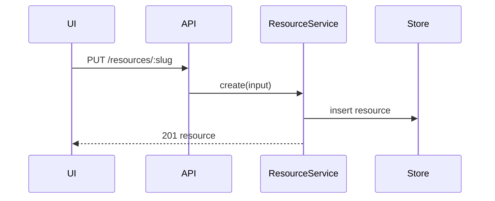

# System Architecture

Phase 2 of four. Align on how the services, endpoints, schemas, queues, and stores talk to each other — the wiring **between** components, not the code inside them.

Comes after `dex-product-review` has settled what we're building. Hands off to `dex-program-design`, which is where the code shape gets decided.

## When to Run

Run for anything that adds or changes a component boundary: a new endpoint, a new table, a new queue, a new service-to-service call.
For medium tasks, write this and the product review as one plan document.
For a large refactor with no product question, this is where the process starts.

This phase is high leverage — a lot of bad model tics get headed off here — but it is **insufficient to produce high-quality code**. Do not stop after it.

## Visualize, Don't Prose

Maximize human↔agent bandwidth. Three artifacts carry most of the weight:

**Sequence diagrams** for the call flow across components:



**Contract / endpoint shapes** — the request and response, concretely:

```text
PUT /api/resources/:slug
  request:  { destination: string }
  response: { resource: Resource }
```

**Data models and transformations** — new tables and the new query shapes that hit them:

```sql
CREATE TABLE resource (
  slug         TEXT PRIMARY KEY,
  destination  TEXT NOT NULL,
  created_at   TIMESTAMPTZ NOT NULL DEFAULT now()
);
```

Mermaid is fine here, but it can be overkill — and it can lure you into a false sense that you are aligned. A diagram is easy to nod along to. Prefer the artifact that is specific enough to disagree with.

## Output

- **Components** — what's new, what changes, what's untouched.
- **Sequence** — the call flow for each new path.
- **Contracts** — endpoint shapes, request and response.
- **Data** — schema changes and new query shapes.
- **Queues / stores / external calls** — anything crossing a process boundary.

Run an **author-opt-in review** on this doc with whoever would review the PR, before coding.

## Constraints

Do not descend into the shape of code — filenames, internal types, call stacks, method signatures are `dex-program-design`'s job.
Do not treat a clean diagram as alignment. If nobody could disagree with it, it isn't saying anything.
Do not ship from this doc alone.
